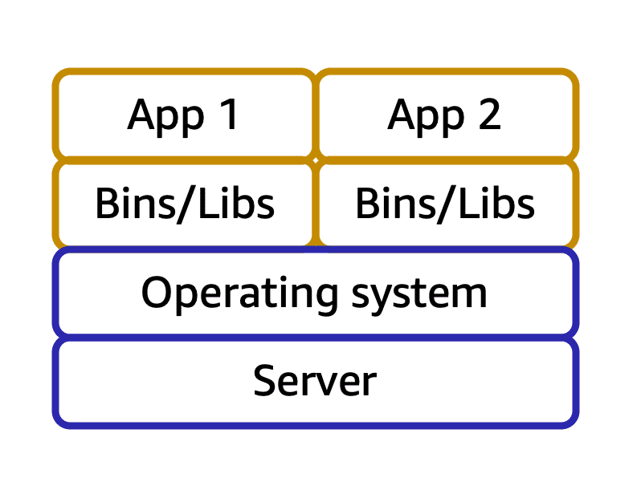

# Additional Compute Services

Serverless computing

Earlier in this module, you learned about Amazon EC2, a service that lets you run virtual servers in the cloud. If you have applications that you want to run in Amazon EC2, you must do the following:

1. Provision instances (virtual servers).

2. Upload your code.

3. Continue to manage the instances while your application is running.

Comparison between computing with virtual servers (thinking about servers and code) and serverless computing (thinking only about code).

The term “serverless” means that your code runs on servers, but you do not need to provision or manage these servers. With serverless computing, you can focus more on innovating new products and features instead of maintaining servers.

Another benefit of serverless computing is the flexibility to scale serverless applications automatically. Serverless computing can adjust the applications' capacity by modifying the units of consumptions, such as throughput and memory.

An AWS service for serverless computing is **AWS Lambda**.

## AWS Lambda

**AWS Lambda** is a service that lets you run code without needing to provision or manage servers.

While using AWS Lambda, you pay only for the compute time that you consume. Charges apply only when your code is running. You can also run code for virtually any type of application or backend service, all with zero administration.

For example, a simple Lambda function might involve automatically resizing uploaded images to the AWS Cloud. In this case, the function triggers when uploading a new image.

How AWS Lambda works

How AWS Lambda works

1. You upload your code to Lambda.

2. You set your code to trigger from an event source, such as AWS services, mobile applications, or HTTP endpoints.

3. Lambda runs your code only when triggered.

4. You pay only for the compute time that you use. In the previous example of resizing images, you would pay only for the compute time that you use when uploading new images. Uploading the images triggers Lambda to run code for the image resizing function.

## Containers

Containers provide you with a standard way to package your application's code and dependencies into a single object. You can also use containers for processes and workflows in which there are essential requirements for security, reliability, and scalability.

Suppose that a company’s application developer has an environment on their computer that is different from the environment on the computers used by the IT operations staff. The developer wants to ensure that the application’s environment remains consistent regardless of deployment, so they use a containerized approach. This helps to reduce time spent debugging applications and diagnosing differences in computing environments.

**Tens of hosts with hundreds of containers**

When running containerized applications, it’s important to consider scalability. Suppose that instead of a single host with multiple containers, you have to manage tens of hosts with hundreds of containers. Alternatively, you have to manage possibly hundreds of hosts with thousands of containers. At a large scale, imagine how much time it might take for you to monitor memory usage, security, logging, and so on.

## Amazon Elastic Container Service (Amazon ECS)

**Amazon Elastic Container Service (Amazon ECS)** is a highly scalable, high-performance container management system that enables you to run and scale containerized applications on AWS. 

Amazon ECS supports Docker containers. Docker(opens in a new tab) is a software platform that enables you to build, test, and deploy applications quickly. AWS supports the use of open-source Docker Community Edition and subscription-based Docker Enterprise Edition. With Amazon ECS, you can use API calls to launch and stop Docker-enabled applications.

## Amazon Elastic Kubernetes Service (Amazon EKS)

**Amazon Elastic Kubernetes Service (Amazon EKS)** is a fully managed service that you can use to run Kubernetes on AWS. 

Kubernetes(opens in a new tab) is open-source software that enables you to deploy and manage containerized applications at scale. A large community of volunteers maintains Kubernetes, and AWS actively works together with the Kubernetes community. As new features and functionalities release for Kubernetes applications, you can easily apply these updates to your applications managed by Amazon EKS.

## AWS Fargate

**AWS Fargate** is a serverless compute engine for containers. It works with both Amazon ECS and Amazon EKS. 

When using AWS Fargate, you do not need to provision or manage servers. AWS Fargate manages your server infrastructure for you. You can focus more on innovating and developing your applications, and you pay only for the resources that are required to run your containers.