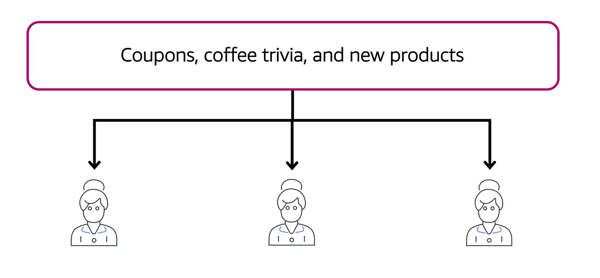
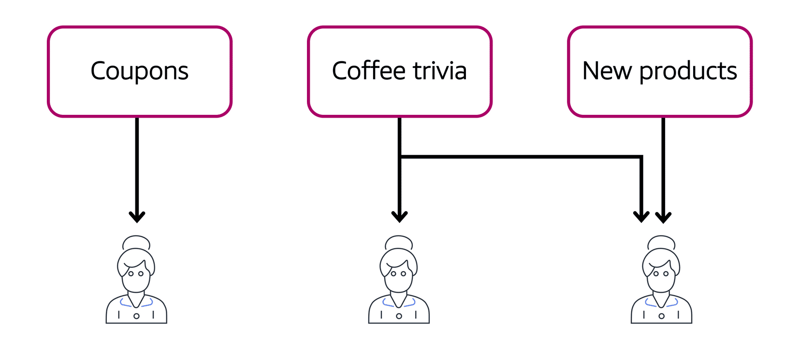

# Messaging and Queuing

## Monolithic applications and microservices

Applications are made of multiple components. The components communicate with each other to transmit data, fulfill requests, and keep the application running. 

Suppose that you have an application with tightly coupled components. These components might include databases, servers, the user interface, business logic, and so on. This type of architecture can be considered a monolithic application. 

In this approach to application architecture, if a single component fails, other components fail, and possibly the entire application fails.

To help maintain application availability when a single component fails, you can design your application through a microservices approach.

In a microservices approach, application components are loosely coupled. In this case, if a single component fails, the other components continue to work because they are communicating with each other. The loose coupling prevents the entire application from failing. 

When designing applications on AWS, you can take a microservices approach with services and components that fulfill different functions. Two services facilitate application integration: Amazon Simple Notification Service (Amazon SNS) and Amazon Simple Queue Service (Amazon SQS).

## Amazon Simple Notification Service (Amazon SNS)

**Amazon Simple Notification Service (Amazon SNS)** is a publish/subscribe service. Using Amazon SNS topics, a publisher publishes messages to subscribers. This is similar to the coffee shop; the cashier provides coffee orders to the barista who makes the drinks.

In Amazon SNS, subscribers can be web servers, email addresses, AWS Lambda functions, or several other options.

Suppose that the coffee shop has a single newsletter that includes updates from all areas of its business. It includes topics such as coupons, coffee trivia, and new products. All of these topics are grouped because this is a single newsletter. All customers who subscribe to the newsletter receive updates about coupons, coffee trivia, and new products.

After a while, some customers express that they would prefer to receive separate newsletters for only the specific topics that interest them. The coffee shop owners decide to try this approach.

Now, instead of having a single newsletter for all topics, the coffee shop has broken it up into three separate newsletters. Each newsletter is devoted to a specific topic: coupons, coffee trivia, and new products.

Subscribers will now receive updates immediately for only the specific topics to which they have subscribed.

It is possible for subscribers to subscribe to a single topic or to multiple topics. For example, the first customer subscribes to only the coupons topic, and the second subscriber subscribes to only the coffee trivia topic. The third customer subscribes to both the coffee trivia and new products topics.