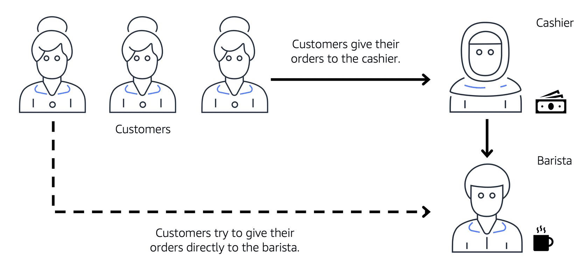
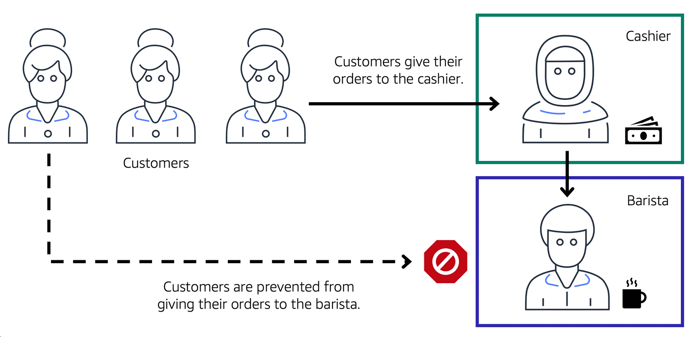
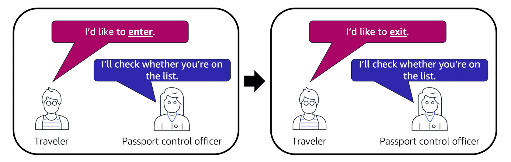

# Connectivity to AWS

## Amazon Virtual Private Cloud (Amazon VPC)

Imagine the millions of customers who use AWS services. Also, imagine the millions of resources that these customers have created, such as Amazon EC2 instances. Without boundaries around all of these resources, network traffic would be able to flow between them unrestricted.

A networking service that you can use to establish boundaries around your AWS resources is **Amazon Virtual Private Cloud (Amazon VPC)**.

Amazon VPC enables you to provision an isolated section of the AWS Cloud. In this isolated section, you can launch resources in a virtual network that you define. Within a virtual private cloud (VPC), you can organize your resources into subnets. A subnet is a section of a VPC that can contain resources such as Amazon EC2 instances.

## Internet gateway

To allow public traffic from the internet to access your VPC, you attach an internet gateway to the VPC.

An internet gateway is a connection between a VPC and the internet. You can think of an internet gateway as being similar to a doorway that customers use to enter the coffee shop. Without an internet gateway, no one can access the resources within your VPC.

## Virtual private gateway

To access private resources in a VPC, you can use a virtual private gateway.

Here’s an example of how a virtual private gateway works. You can think of the internet as the road between your home and the coffee shop. Suppose that you are traveling on this road with a bodyguard to protect you. You are still using the same road as other customers, but with an extra layer of protection.

The bodyguard is like a virtual private network (VPN) connection that encrypts (or protects) your internet traffic from all the other requests around it.

The virtual private gateway is the component that allows protected internet traffic to enter into the VPC. Even though your connection to the coffee shop has extra protection, traffic jams are possible because you’re using the same road as other customers.

A virtual private gateway enables you to establish a virtual private network (VPN) connection between your VPC and a private network, such as an on-premises data center or internal corporate network. A virtual private gateway allows traffic into the VPC only if it is coming from an approved network.

## AWS Direct Connect

**AWS Direct Connect** is a service that lets you to establish a dedicated private connection between your data center and a VPC.  

Suppose that there is an apartment building with a hallway directly linking the building to the coffee shop. Only the residents of the apartment building can travel through this hallway.

This private hallway provides the same type of dedicated connection as AWS Direct Connect. Residents are able to get into the coffee shop without needing to use the public road shared with other customers.

A corporate data center routes network traffic to an AWS Direct Connect location. That traffic is then routed to a VPC through a virtual private gateway. All network traffic between the corporate data center and VPC flows through this dedicated private connection.

The private connection that AWS Direct Connect provides helps you to reduce network costs and increase the amount of bandwidth that can travel through your network.

## Subnets and Network Access Control Lists

To learn more about the role of subnets within a VPC, review the following example from the coffee shop.

First, customers give their orders to the cashier. The cashier then passes the orders to the barista. This process allows the line to keep running smoothly as more customers come in.

Suppose that some customers try to skip the cashier line and give their orders directly to the barista. This disrupts the flow of traffic and results in customers accessing a part of the coffee shop that is restricted to them.

To fix this, the owners of the coffee shop divide the counter area by placing the cashier and the barista in separate workstations. The cashier’s workstation is public facing and designed to receive customers. The barista’s area is private. The barista can still receive orders from the cashier but not directly from customers.

A cashier, a barista, and three customers in line. The icon for the first customer in line has an arrow pointing to cashier showing that the customer gives their order to the cashier. Then the cashier icon has an arrow pointing to barista icon showing that the cashier forwards the customer's order to the barista. The last customer in line tries to give their order directly to the barista, but they're blocked from doing so.

This is similar to how you can use AWS networking services to isolate resources and determine exactly how network traffic flows.

In the coffee shop, you can think of the counter area as a VPC. The counter area divides into two separate areas for the cashier’s workstation and the barista’s workstation. In a VPC, subnets are separate areas that are used to group together resources.

## Subnets

A subnet is a section of a VPC in which you can group resources based on security or operational needs. Subnets can be public or private.

 

 Public subnets contain resources that need to be accessible by the public, such as an online store’s website.

Private subnets contain resources that should be accessible only through your private network, such as a database that contains customers’ personal information and order histories.

In a VPC, subnets can communicate with each other. For example, you might have an application that involves Amazon EC2 instances in a public subnet communicating with databases that are located in a private subnet.

## Network traffic in a VPC

When a customer requests data from an application hosted in the AWS Cloud, this request is sent as a packet. A **packet** is a unit of data sent over the internet or a network.

It enters into a VPC through an internet gateway. Before a packet can enter into a subnet or exit from a subnet, it checks for permissions. These permissions indicate who sent the packet and how the packet is trying to communicate with the resources in a subnet.

The VPC component that checks packet permissions for subnets is a **network access control list (ACL)**.

## Network ACLs

A network ACL is a virtual firewall that controls inbound and outbound traffic at the subnet level.

For example, step outside of the coffee shop and imagine that you are in an airport. In the airport, travelers are trying to enter into a different country. You can think of the travelers as packets and the passport control officer as a network ACL. The passport control officer checks travelers’ credentials when they are both entering and exiting out of the country. If a traveler is on an approved list, they are able to get through. However, if they are not on the approved list or are explicitly on a list of banned travelers, they cannot come in.

Each AWS account includes a default network ACL. When configuring your VPC, you can use your account’s default network ACL or create custom network ACLs.

By default, your account’s default network ACL allows all inbound and outbound traffic, but you can modify it by adding your own rules. For custom network ACLs, all inbound and outbound traffic is denied until you add rules to specify which traffic to allow. Additionally, all network ACLs have an explicit deny rule. This rule ensures that if a packet doesn’t match any of the other rules on the list, the packet is denied.

## Stateless packet filtering

Network ACLs perform stateless packet filtering. They remember nothing and check packets that cross the subnet border each way: inbound and outbound.

Recall the previous example of a traveler who wants to enter into a different country. This is similar to sending a request out from an Amazon EC2 instance and to the internet.

When a packet response for that request comes back to the subnet, the network ACL does not remember your previous request. The network ACL checks the packet response against its list of rules to determine whether to allow or deny.

After a packet has entered a subnet, it must have its permissions evaluated for resources within the subnet, such as Amazon EC2 instances.

The VPC component that checks packet permissions for an Amazon EC2 instance is a security group.

## Security groups

A security group is a virtual firewall that controls inbound and outbound traffic for an Amazon EC2 instance.

By default, a security group denies all inbound traffic and allows all outbound traffic. You can add custom rules to configure which traffic should be allowed; any other traffic would then be denied

For this example, suppose that you are in an apartment building with a door attendant who greets guests in the lobby. You can think of the guests as packets and the door attendant as a security group. As guests arrive, the door attendant checks a list to ensure they can enter the building. However, the door attendant does not check the list again when guests are exiting the building

If you have multiple Amazon EC2 instances within the same VPC, you can associate them with the same security group or use different security groups for each instance.

## Stateful packet filtering

Security groups perform stateful packet filtering. They remember previous decisions made for incoming packets.

Consider the same example of sending a request out from an Amazon EC2 instance to the internet.

When a packet response for that request returns to the instance, the security group remembers your previous request. The security group allows the response to proceed, regardless of inbound security group rules.

With both network ACLs and security groups, you can configure custom rules for the traffic in your VPC. As you continue to learn more about AWS security and networking, make sure to understand the differences between network ACLs and security groups.

A packet travels over the internet from a client, to the internet gateway and into the VPC. Then the pack goes through the network access control list and accesses the public subnet, where two EC2 instances are located.

## VPC component recall

Recall the purpose of the following four VPC components. Compare your response by choosing each VPC component flashcard.

## Global Networking

### Domain Name System (DNS)

Suppose that AnyCompany has a website hosted in the AWS Cloud. Customers enter the web address into their browser, and they are able to access the website. This happens because of **Domain Name System (DNS)** resolution. DNS resolution involves a customer DNS resolver communicating with a company DNS server.

You can think of DNS as being the phone book of the internet. DNS resolution is the process of translating a domain name to an IP address.

A client connects to a DNS resolver looking for a domain. The resolver forwards the request to the DNS server, which returns the IP address to the resolver.

1. When you enter the domain name into your browser, this request is sent to a customer DNS resolver.

2. The customer DNS resolver asks the company DNS server for the IP address that corresponds to AnyCompany’s website.

3.The company DNS server responds by providing the IP address for AnyCompany’s website, 192.0.2.0.

### Amazon Route 53

Amazon Route 53 is a DNS web service. It gives developers and businesses a reliable way to route end users to internet applications hosted in AWS. 

Amazon Route 53 connects user requests to infrastructure running in AWS (such as Amazon EC2 instances and load balancers). It can route users to infrastructure outside of AWS.

Another feature of Route 53 is the ability to manage the DNS records for domain names. You can register new domain names directly in Route 53. You can also transfer DNS records for existing domain names managed by other domain registrars. This enables you to manage all of your domain names within a single location.

In the previous module, you learned about Amazon CloudFront, a content delivery service. The following example describes how Route 53 and Amazon CloudFront work together to deliver content to customers.

### Example: How Amazon Route 53 and Amazon CloudFront deliver content

Suppose that AnyCompany’s application is running on several Amazon EC2 instances. These instances are in an Auto Scaling group that attaches to an Application Load Balancer.

1. A customer requests data from the application by going to AnyCompany’s website.

2. Amazon Route 53 uses DNS resolution to identify AnyCompany.com’s corresponding IP address, 192.0.2.0. This information is sent back to the customer.

3. The customer’s request is sent to the nearest edge location through Amazon CloudFront.

4. Amazon CloudFront connects to the Application Load Balancer, which sends the incoming packet to an Amazon EC2 instance.

