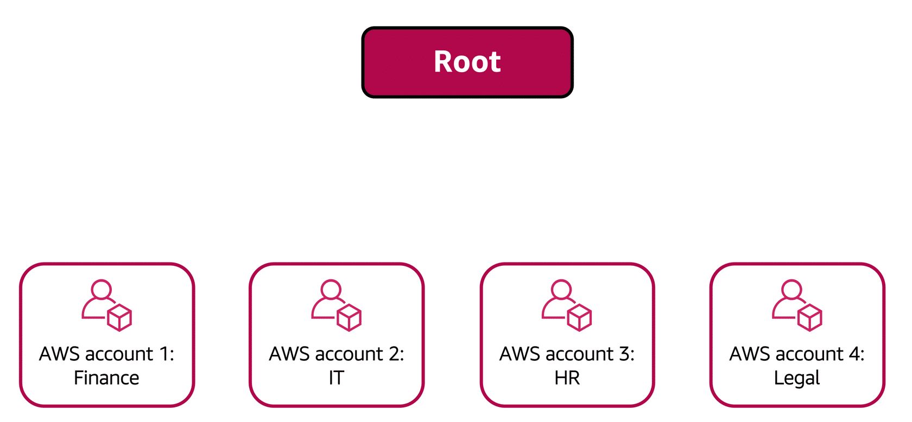
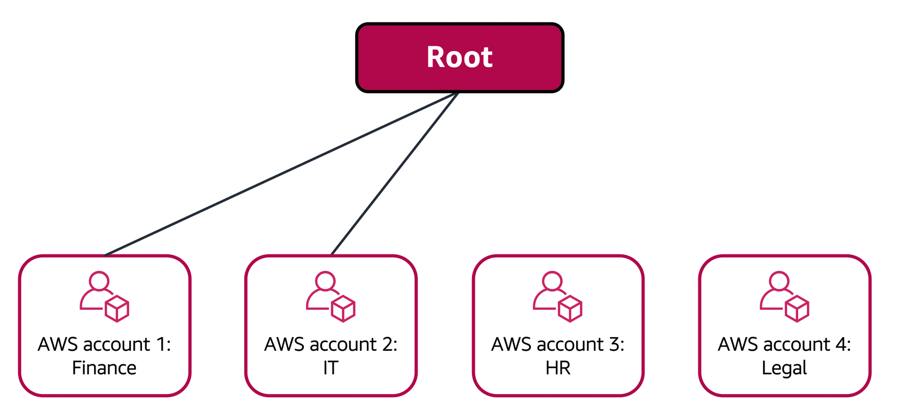

# AWS Organizations

Suppose that your company has multiple AWS accounts. You can use **AWS Organizations** to consolidate and manage multiple AWS accounts within a central location.

When you create an organization, AWS Organizations automatically creates a root, which is the parent container for all the accounts in your organization.

In AWS Organizations, you can centrally control permissions for the accounts in your organization by using **service control policies (SCPs)**. SCPs enable you to place restrictions on the AWS services, resources, and individual API actions that users and roles in each account can access.

## Organizational units

In AWS Organizations, you can group accounts into organizational units (OUs) to make it easier to manage accounts with similar business or security requirements. When you apply a policy to an OU, all the accounts in the OU automatically inherit the permissions specified in the policy.  

By organizing separate accounts into OUs, you can more easily isolate workloads or applications that have specific security requirements. For instance, if your company has accounts that can access only the AWS services that meet certain regulatory requirements, you can put these accounts into one OU. Then, you can attach a policy to the OU that blocks access to all other AWS services that do not meet the regulatory requirements.

Imagine that your company has separate AWS accounts for the finance, information technology (IT), human resources (HR), and legal departments. You decide to consolidate these accounts into a single organization so that you can administer them from a central location. When you create the organization, this establishes the root.

In designing your organization, you consider the business, security, and regulatory needs of each department. You use this information to decide which departments group together in OUs.

The finance and IT departments have requirements that do not overlap with those of any other department. You bring these accounts into your organization to take advantage of benefits such as consolidated billing, but you do not place them into any OUs.

The HR and legal departments need to access the same AWS services and resources, so you place them into an OU together. Placing them into an OU empowers you to attach policies that apply to both the HR and legal departments’ AWS accounts.

**Conclusion**

Even though you have placed these accounts into OUs, you can continue to provide access for users, groups, and roles through IAM.

By grouping your accounts into OUs, you can easily give them access to the services and resources that they need. You also prevent them from accessing any services or resources that they do not need.
