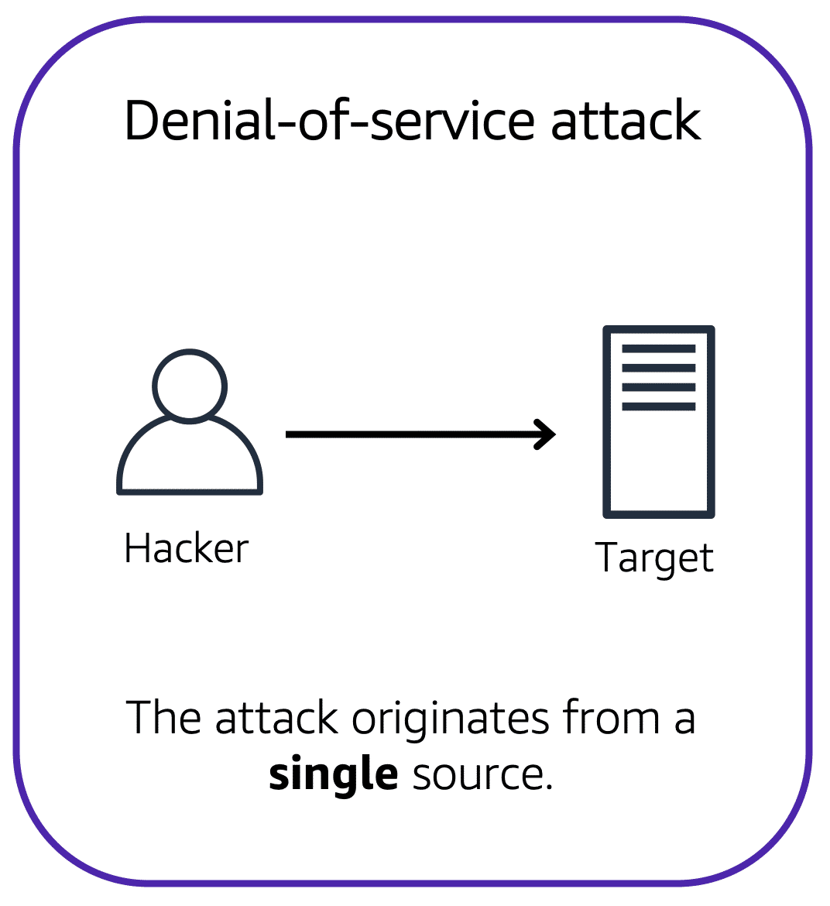

# Denial-of-Service Attacks

Customers can call the coffee shop to place their orders. After answering each call, a cashier takes the order and gives it to the barista. 

However, suppose that a prankster is calling in multiple times to place orders but is never picking up their drinks. This causes the cashier to be unavailable to take other customers’ calls. The coffee shop can attempt to stop the false requests by blocking the phone number that the prankster is using.

In this scenario, the prankster’s actions are similar to a **denial-of-service attack**.

## Denial-of-service attacks

A **denial-of-service (DoS) attack** is a deliberate attempt to make a website or application unavailable to users.

For example, an attacker might flood a website or application with excessive network traffic until the targeted website or application becomes overloaded and is no longer able to respond. If the website or application becomes unavailable, this denies service to users who are trying to make legitimate requests.

## Distributed denial-of-service attacks

Now, suppose that the prankster has enlisted the help of friends. 

The prankster and their friends repeatedly call the coffee shop with requests to place orders, even though they do not intend to pick them up. These requests are coming in from different phone numbers, and it’s impossible for the coffee shop to block them all. Additionally, the influx of calls has made it increasingly difficult for customers to be able to get their calls through. This is similar to a **distributed denial-of-service attack**.

In a distributed denial-of-service (DDoS) attack, multiple sources are used to start an attack that aims to make a website or application unavailable. This can come from a group of attackers, or even a single attacker. The single attacker can use multiple infected computers (also known as “bots”) to send excessive traffic to a website or application.

To help minimize the effect of DoS and DDoS attacks on your applications, you can use **AWS Shield**.

## AWS Shield

AWS Shield is a service that protects applications against DDoS attacks. AWS Shield provides two levels of protection: Standard and Advanced.

To learn more about AWS Shield, expand each of the following two categories.

## AWS Shield Standard

AWS Shield Standard automatically protects all AWS customers at no cost. It protects your AWS resources from the most common, frequently occurring types of DDoS attacks.

As network traffic comes into your applications, AWS Shield Standard uses a variety of analysis techniques to detect malicious traffic in real time and automatically mitigates it.

## AWS Shield Advanced

**AWS Shield Advanced** is a paid service that provides detailed attack diagnostics and the ability to detect and mitigate sophisticated DDoS attacks.

It also integrates with other services such as Amazon CloudFront, Amazon Route 53, and Elastic Load Balancing. Additionally, you can integrate AWS Shield with AWS WAF by writing custom rules to mitigate complex DDoS attacks.

## Additional Security Services

## AWS Key Management Service (AWS KMS)

The coffee shop has many items, such as coffee machines, pastries, money in the cash registers, and so on. You can think of these items as data. The coffee shop owners want to ensure that all of these items are secure, whether they’re sitting in the storage room or being transported between shop locations. 

In the same way, you must ensure that your applications’ data is secure while in storage (**encryption at rest**) and while it is transmitted, known as **encryption in transit**.

**AWS Key Management Service (AWS KMS)** enables you to perform encryption operations through the use of **cryptographic keys**. A cryptographic key is a random string of digits used for locking (encrypting) and unlocking (decrypting) data. You can use AWS KMS to create, manage, and use cryptographic keys. You can also control the use of keys across a wide range of services and in your applications.

With AWS KMS, you can choose the specific levels of access control that you need for your keys. For example, you can specify which IAM users and roles are able to manage keys. Alternatively, you can temporarily disable keys so that they are no longer in use by anyone. Your keys never leave AWS KMS, and you are always in control of them.

## AWS WAF

AWS WAF(opens in a new tab) is a web application firewall that lets you monitor network requests that come into your web applications. 

AWS WAF works together with Amazon CloudFront and an Application Load Balancer. Recall the network access control lists that you learned about in an earlier module. AWS WAF works in a similar way to block or allow traffic. However, it does this by using a web access control list (ACL)(opens in a new tab) to protect your AWS resources. 

Suppose that your application has been receiving malicious network requests from several IP addresses. You want to prevent these requests from continuing to access your application, but you also want to ensure that legitimate users can still access it. You configure the web ACL to allow all requests except those from the IP addresses that you have specified.

When a request comes into AWS WAF, it checks against the list of rules that you have configured in the web ACL. If a request does not come from one of the blocked IP addresses, it allows access to the application.

However, if a request comes from one of the blocked IP addresses that you have specified in the web ACL, AWS WAF denies access.

## Amazon Inspector

Suppose that the developers at the coffee shop are developing and testing a new ordering application. They want to make sure that they are designing the application in accordance with security best practices. However, they have several other applications to develop, so they cannot spend much time conducting manual assessments. To perform automated security assessments, they decide to use Amazon Inspector(opens in a new tab).

Amazon Inspector helps to improve the security and compliance of applications by running automated security assessments. It checks applications for security vulnerabilities and deviations from security best practices, such as open access to Amazon EC2 instances and installations of vulnerable software versions.

After Amazon Inspector has performed an assessment, it provides you with a list of security findings. The list prioritizes by severity level, including a detailed description of each security issue and a recommendation for how to fix it. However, AWS does not guarantee that following the provided recommendations resolves every potential security issue. Under the shared responsibility model, customers are responsible for the security of their applications, processes, and tools that run on AWS services.

## Amazon GuardDuty

**Amazon GuardDuty** is a service that provides intelligent threat detection for your AWS infrastructure and resources. It identifies threats by continuously monitoring the network activity and account behavior within your AWS environment.

After you have enabled GuardDuty for your AWS account, GuardDuty begins monitoring your network and account activity. You do not have to deploy or manage any additional security software. GuardDuty then continuously analyzes data from multiple AWS sources, including VPC Flow Logs and DNS logs.

If GuardDuty detects any threats, you can review detailed findings about them from the AWS Management Console. Findings include recommended steps for remediation. You can also configure AWS Lambda functions to take remediation steps automatically in response to GuardDuty’s security findings.

