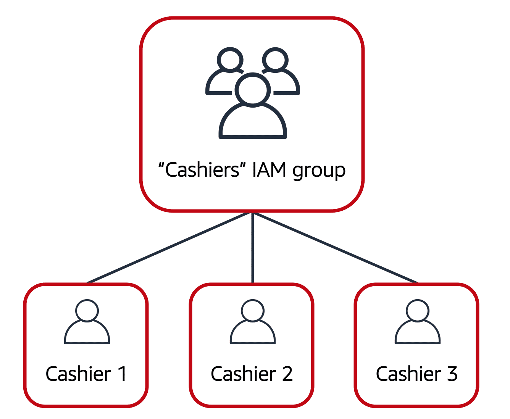
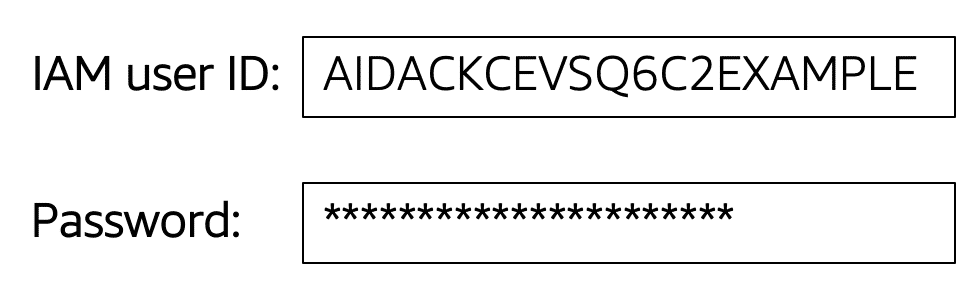

# User Permissions and Access

## AWS Identity and Access Management (IAM)

**AWS Identity and Access Management (IAM)** enables you to manage access to AWS services and resources securely.

IAM gives you the flexibility to configure access based on your company’s specific operational and security needs. You do this by using a combination of IAM features, which are explored in detail in this lesson:

- IAM users, groups, and roles
- IAM policies
- Multi-factor authentication
You will also learn best practices for each of these features.

## AWS account root user

When you first create an AWS account, you begin with an identity known as the **root user**.

The root user is accessed by signing in with the email address and password that you used to create your AWS account. You can think of the root user as being similar to the owner of the coffee shop. It has complete access to all the AWS services and resources in the account.

## IAM users

An **IAM user** is an identity that you create in AWS. It represents the person or application that interacts with AWS services and resources. It consists of a name and credentials.

By default, when you create a new IAM user in AWS, it has no permissions associated with it. To allow the IAM user to perform specific actions in AWS, such as launching an Amazon EC2 instance or creating an Amazon S3 bucket, you must grant the IAM user the necessary permissions.

**Best practice**:

We recommend that you create individual IAM users for each person who needs to access AWS.  

Even if you have multiple employees who require the same level of access, you should create individual IAM users for each of them. This provides additional security by allowing each IAM user to have a unique set of security credentials.

## IAM policies

An IAM policy is a document that allows or denies permissions to AWS services and resources.  

IAM policies enable you to customize users’ levels of access to resources. For example, you can allow users to access all of the Amazon S3 buckets within your AWS account, or only a specific bucket.

**Best practice**:

Follow the security principle of **least privilege** when granting permissions.

By following this principle, you help to prevent users or roles from having more permissions than needed to perform their tasks.

For example, if an employee needs access to only a specific bucket, specify the bucket in the IAM policy. Do this instead of granting the employee access to all of the buckets in your AWS account.

## Example: IAM policy

Here’s an example of how IAM policies work. Suppose that the coffee shop owner has to create an IAM user for a newly hired cashier. The cashier needs access to the receipts kept in an Amazon S3 bucket with the ID: AWSDOC-EXAMPLE-BUCKET.

In this example, the IAM policy is allowing a specific action within Amazon S3: ListObject. The policy also mentions a specific bucket ID: AWSDOC-EXAMPLE-BUCKET. When the owner attaches this policy to the cashier’s IAM user, it will allow the cashier to view all of the objects in the AWSDOC-EXAMPLE-BUCKET bucket.

If the owner wants the cashier to be able to access other services and perform other actions in AWS, the owner must attach additional policies to specify these services and actions.

Now, suppose that the coffee shop has hired a few more cashiers. Instead of assigning permissions to each individual IAM user, the owner places the users into an **IAM group**.

## IAM groups

An IAM group is a collection of IAM users. When you assign an IAM policy to a group, all users in the group are granted permissions specified by the policy.

Here’s an example of how this might work in the coffee shop. Instead of assigning permissions to cashiers one at a time, the owner can create a “Cashiers” IAM group. The owner can then add IAM users to the group and then attach permissions at the group level.

Assigning IAM policies at the group level also makes it easier to adjust permissions when an employee transfers to a different job. For example, if a cashier becomes an inventory specialist, the coffee shop owner removes them from the “Cashiers” IAM group and adds them into the “Inventory Specialists” IAM group. This ensures that employees have only the permissions that are required for their current role.

What if a coffee shop employee hasn’t switched jobs permanently, but instead, rotates to different workstations throughout the day? This employee can get the access they need through IAM roles(opens in a new tab).

## IAM roles

In the coffee shop, an employee rotates to different workstations throughout the day. Depending on the staffing of the coffee shop, this employee might perform several duties: work at the cash register, update the inventory system, process online orders, and so on.

When the employee needs to switch to a different task, they give up their access to one workstation and gain access to the next workstation. The employee can easily switch between workstations, but at any given point in time, they can have access to only a single workstation. This same concept exists in AWS with IAM roles.

An IAM role is an identity that you can assume to gain temporary access to permissions.  

Before an IAM user, application, or service can assume an IAM role, they must be granted permissions to switch to the role. When someone assumes an IAM role, they abandon all previous permissions that they had under a previous role and assume the permissions of the new role.

**Best practice**:

IAM roles are ideal for situations in which access to services or resources needs to be granted temporarily, instead of long-term.

## Multi-factor authentication

Have you ever signed in to a website that required you to provide multiple pieces of information to verify your identity? You might have needed to provide your password and then a second form of authentication, such as a random code sent to your phone. This is an example of multi-factor authentication(opens in a new tab).

In IAM, multi-factor authentication (MFA) provides an extra layer of security for your AWS account.

First, a user enters their IAM user ID and password to sign in to an AWS website.

Next, the user is prompted for an authentication response from their AWS MFA device. This device could be a hardware security key, a hardware device, or an MFA application on a device such as a smartphone.

When the user has been successfully authenticated, they are able to access the requested AWS services or resources.

You can enable MFA for the root user and IAM users. As a best practice, enable MFA for the root user and all IAM users in your account. By doing this, you can keep your AWS account safe from unauthorized access.
