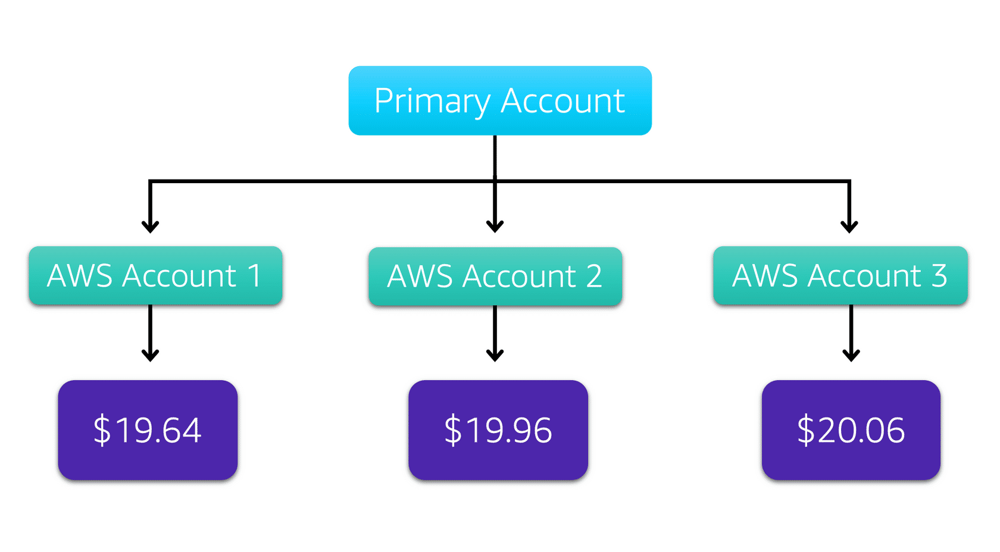
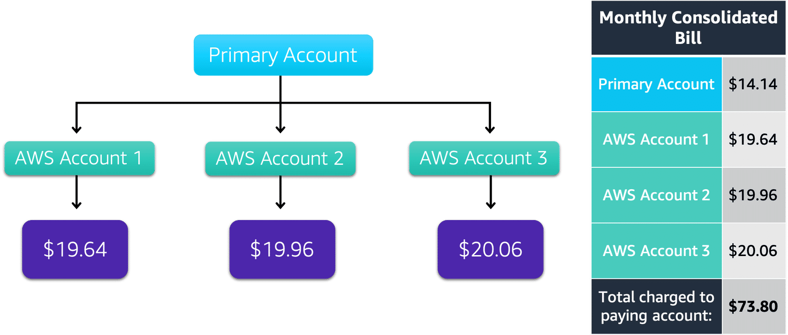

# Consolidated Billing

In an earlier module, you learned about AWS Organizations, a service that enables you to manage multiple AWS accounts from a central location. AWS Organizations also provides the option for **consolidated billing**.

The consolidated billing feature of AWS Organizations enables you to receive a single bill for all AWS accounts in your organization. By consolidating, you can easily track the combined costs of all the linked accounts in your organization. The default maximum number of accounts allowed for an organization is 4, but you can contact AWS Support to increase your quota, if needed.

On your monthly bill, you can review itemized charges incurred by each account. This enables you to have greater transparency into your organization’s accounts while still maintaining the convenience of receiving a single monthly bill.

Another benefit of consolidated billing is the ability to share bulk discount pricing, Savings Plans, and Reserved Instances across the accounts in your organization. For instance, one account might not have enough monthly usage to qualify for discount pricing. However, when multiple accounts are combined, their aggregated usage may result in a benefit that applies across all accounts in the organization.

Suppose that you are the business leader who oversees your company’s AWS billing.

Your company has three AWS accounts used for separate departments. In this example, Account 1 owes $19.64, Account 2 owes $19.96, and Account 3 owes $20.06. Instead of paying each location’s monthly bill separately, you decide to create an organization and add the three accounts.

You manage the organization through the primary account.

Continuing the example, each month AWS charges your primary payer account for all the linked accounts in a consolidated bill. Through the primary account, you can also get a detailed cost report for each linked account.

The monthly consolidated bill also includes the account usage costs incurred by the primary account. In this case, the primary account incurred $14.14. This cost is not a premium charge for having a primary account.

The consolidated bill shows the costs associated with any actions of the primary account (such as storing files in Amazon S3 or running Amazon EC2 instances). The total charged to the paying account, including the primary account and accounts one through three, is $73.80.

Consolidated billing also enables you to share volume pricing discounts across accounts.

Some AWS services, such as Amazon S3, provide volume pricing discounts that give you lower prices the more that you use the service. In Amazon S3, after customers have transferred 10 TB of data in a month, they pay a lower per-GB transfer price for the next 40 TB of data transferred.

In this example, there are three separate AWS accounts that have transferred different amounts of data in Amazon S3 during the current month:

- Account 1 has transferred 2 TB of data.
- Account 2 has transferred 5 TB of data.
- Account 3 has transferred 7 TB of data.

Because no single account has passed the 10 TB threshold, none of them is eligible for the lower per-GB transfer price for the next 40 TB of data transferred.

Now, suppose that these three separate accounts are brought together as linked accounts within a single AWS organization and are using consolidated billing.

When the Amazon S3 usage for the three linked accounts is combined (2+5+7), this results in a combined data transfer amount of 14 TB. This exceeds the 10-TB threshold.

With consolidated billing, AWS combines the usage from all accounts to determine which volume pricing tiers to apply, giving you a lower overall price whenever possible. AWS then allocates each linked account a portion of the overall volume discount based on the account's usage.

In this example, Account 3 would receive a greater portion of the overall volume discount because at 7 TB, it has transferred more data than Account 1 (at 2 TB) and Account 2 (at 5 TB).